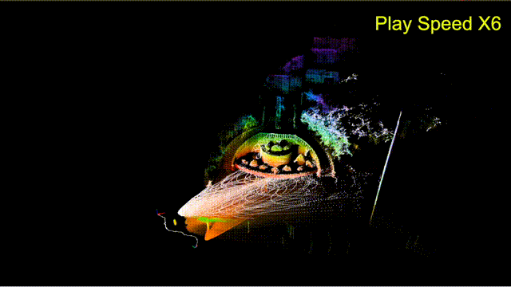
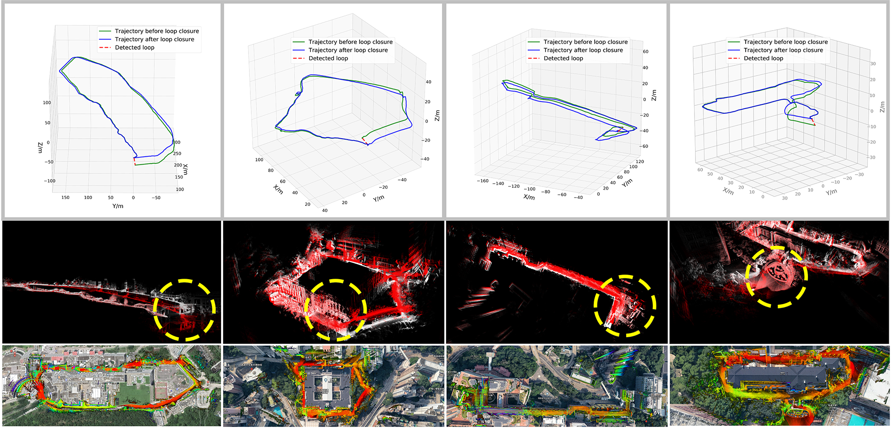
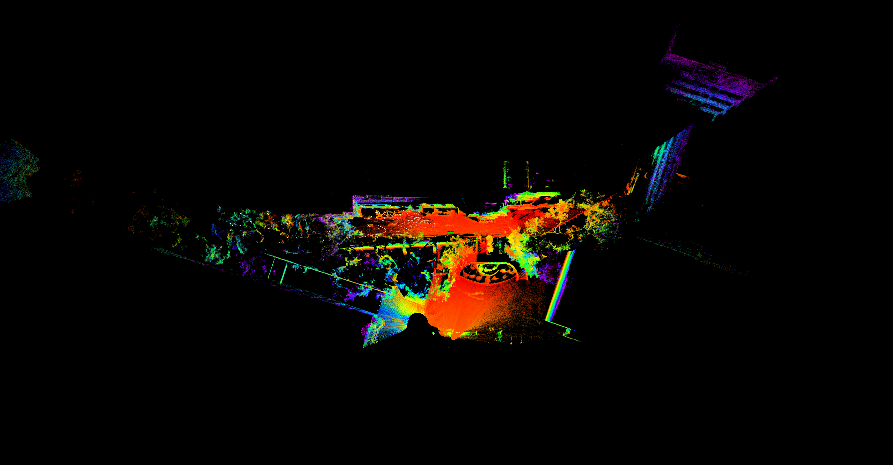
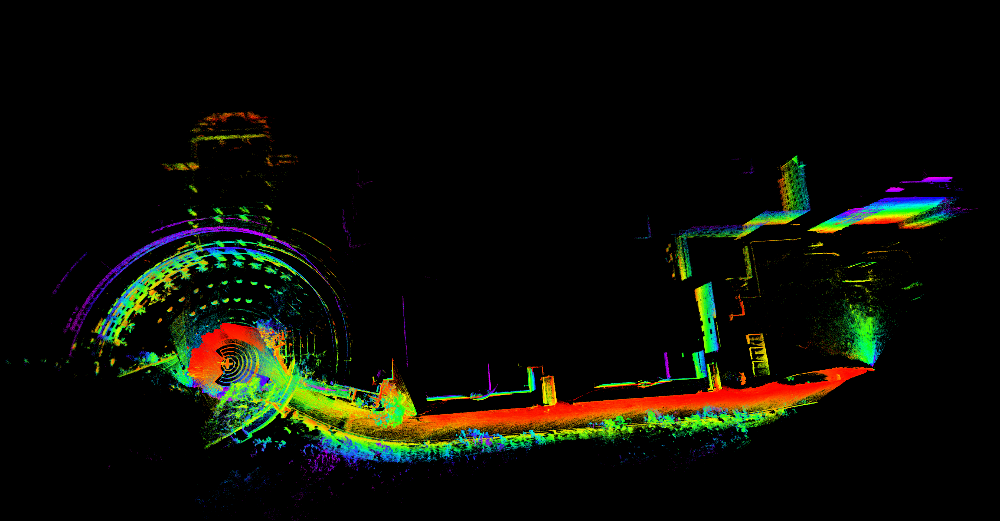
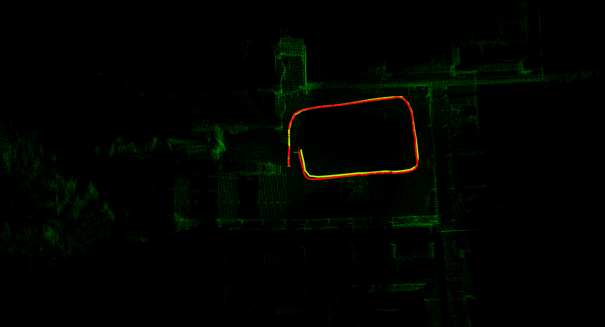
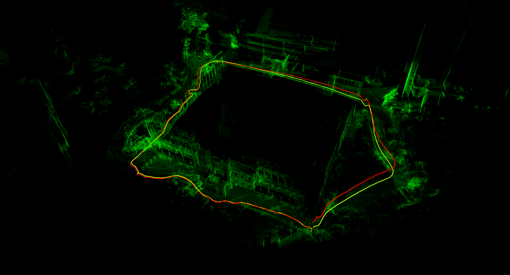
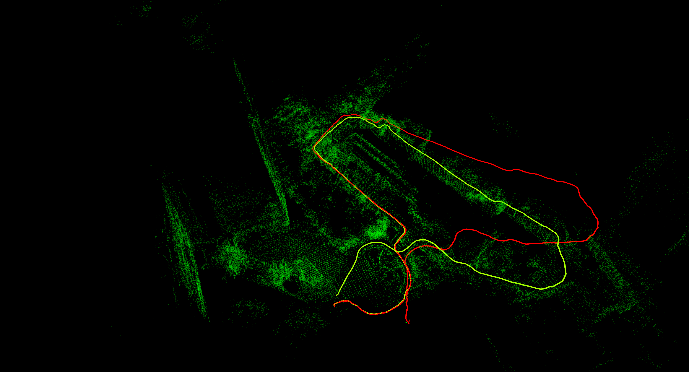
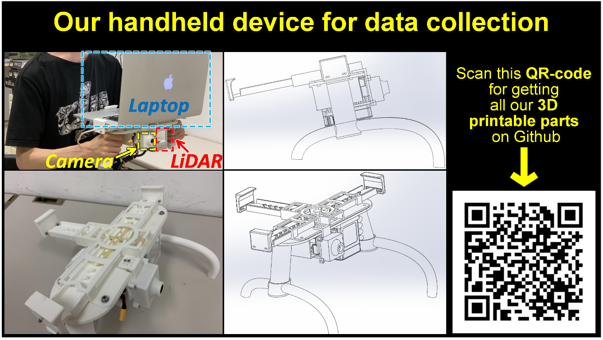
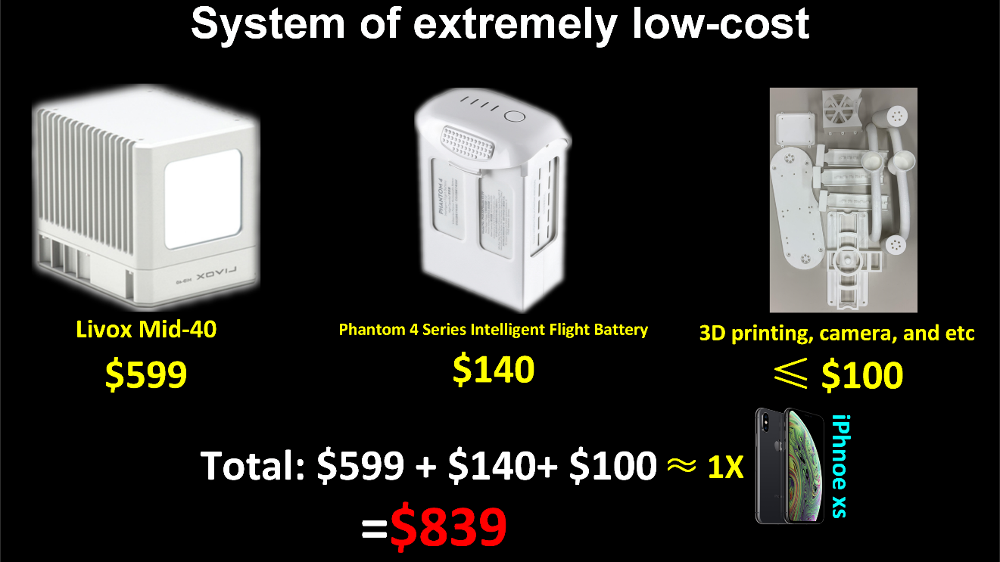

# LOAM-Livox
## A robust LiDAR Odometry and Mapping (LOAM) package for Livox-LiDAR

<div align="center">
    
    
</div>

**Loam-Livox** is a robust, low drift, and real time odometry and mapping package for [*Livox LiDARs*](https://www.livoxtech.com/), significant low cost and high performance LiDARs that are designed for massive industrials uses. Our package address many key issues: feature extraction and selection in a very limited FOV, robust outliers rejection, moving objects filtering, and motion distortion compensation. In addition, we also integrate other features like parallelable pipeline, point cloud management using cells and maps, loop closure, utilities for maps saving and reload, etc. To know more about the details, please refer to our related paper:)

<div align="center">
    
</div>


In the development of our package, we reference to LOAM, [LOAM_NOTED](https://github.com/cuitaixiang/LOAM_NOTED), and [A-LOAM](https://github.com/HKUST-Aerial-Robotics/A-LOAM).

**Developer:** [Jiarong Lin](https://github.com/ziv-lin)

**Our related paper**: our related papers are now available on arxiv:
1. [Loam_livox: A fast, robust, high-precision LiDAR odometry and mapping package for LiDARs of small FoV](https://arxiv.org/abs/1909.06700)
2. [A fast, complete, point cloud based loop closure for LiDAR odometry and mapping](https://arxiv.org/abs/1909.11811)

**Our related video**: our related videos are now available on YouTube (click below images to open):
<div align="center">
<a href="https://youtu.be/WHbbtU-Q9-k" target="_blank"></a>
<a href="https://youtu.be/Uq8rUEk-XnI" target="_blank"></a>
</div>


## 1. Prerequisites
### 1.1 **Ubuntu** and **ROS**
Ubuntu 64-bit 16.04 or 18.04.
ROS Kinetic or Melodic. [ROS Installation](http://wiki.ros.org/ROS/Installation) and its additional ROS pacakge:

```
    sudo apt-get install ros-XXX-cv-bridge ros-XXX-tf ros-XXX-message-filters ros-XXX-image-transport
```
**NOTICE:** remember to replace "XXX" on above command as your ROS distributions, for example, if your use ROS-kinetic, the command should be:

```
    sudo apt-get install ros-kinetic-cv-bridge ros-kinetic-tf ros-kinetic-message-filters ros-kinetic-image-transport
```

### 1.2. **Ceres Solver**
Follow [Ceres Installation](http://ceres-solver.org/installation.html).

### 1.3. **PCL**
Follow [PCL Installation](http://www.pointclouds.org/downloads/linux.html).

**NOTICE:** Recently, we find that the point cloud output form the voxelgrid filter vary form PCL 1.7 and 1.9, and PCL 1.7 leads some failure in some of our examples ([issue #28](https://github.com/hku-mars/loam_livox/issues/28)). By this, we strongly recommand you to use update your PCL as version 1.9 if you are using the lower version.

## 2. Build
Clone the repository and catkin_make:

```
    cd ~/catkin_ws/src
    git clone https://github.com/hku-mars/loam_livox.git
    cd ../
    catkin_make
    source ~/catkin_ws/devel/setup.bash
```
## 3. Directly run
### 3.1 Livox Mid-40
Connect to your PC to Livox LiDAR (Mid-40) by following  [Livox-ros-driver installation](https://github.com/Livox-SDK/livox_ros_driver), then (launch our algorithm **first**, then livox-ros-driver):

```
    roslaunch loam_livox livox.launch
    roslaunch livox_ros_driver livox_lidar.launch
```
### 3.2 Livox Mid-100
Unfortunately, the default configuration of Livox-ros-driver mix all three lidar point cloud as together, which causes some difficulties in our feature extraction and motion blur compensation. By this, some of the adaptations (modify some configurations) are required to launch our package. 

For more details, please kindly refer our [**tutorials (click me to open)**](./Tutorial_Mid-100.md).

## 4. Rosbag Example
### 4.1. **Common rosbag**
Download [Our recorded rosbag](https://drive.google.com/drive/folders/1HWomWWPSEVvka2QVB2G41iRvSwIt5NWf?usp=sharing) and then
```
roslaunch loam_livox rosbag.launch
rosbag play YOUR_DOWNLOADED.bag
```
<div align="center">
    
    
</div>

<div align="center">
    
    
</div>

### 4.1. **Large-scale rosbag**
For large scale rosbag (for example, the [HKUST_01.bag](https://drive.google.com/file/d/1OoAu0WcRhyDsQB9ltPLWeZ2WZlGJz6LO/view?usp=sharing) ), we recommand you launch with bigger line and plane resolution (using *rosbag_largescale.launch*)
```
roslaunch loam_livox rosbag_largescale.launch
rosbag play YOUR_DOWNLOADED.bag
```
<div align="center">
    
    
</div>

### 4.2 **Livox Mid-100 example**
Download our recorded rosbag files ([mid100_example.bag](https://drive.google.com/open?id=1hvjmt4YuGROE-3HWqOfUdofc6zvXxjmU) ), then:
```
roslaunch loam_livox rosbag_mid100.launch
rosbag play mid100_example.bag
```
<div align="center">
    
</div>

## 5. Rosbag Example with loop closure enabled

### 5.1. **Loop closure demostration**
We provide a rosbag file of small size (named "loop_loop_hku_zym.bag", [Download here](https://drive.google.com/file/d/1rXRzbiZYeFtCWhmwCj8OuZaUUkGCsNrM)) for demostration:
<div align="center">
    
</div>

```
roslaunch loam_livox rosbag_loop_simple.launch
rosbag play YOUR_PATH/loop_simple.bag
```
### 5.2. **Other examples**
<div align="center">
    
    
</div>

For other example ([loop_loop_hku_zym.bag](https://drive.google.com/open?id=1J3sVQEwnkjaimf9abH1qjId1S4VEZuMu), [loop_hku_main.bag](https://drive.google.com/open?id=1HrlFkzLMfcYbQsbOiSlSlm5blybrSVd2)), launch with:
```
roslaunch loam_livox rosbag_loop.launch
rosbag play YOUR_DOWNLOADED.bag
```
**NOTICE:** The only difference between launch files "rosbag_loop_simple.launch" and "rosbag_loop.launch" is the minimum number of keyframes (minimum_keyframe_differen) between two candidate frames of loop detection. 


## 6. Have troubles in downloading the rosbag files?
If you have some troubles in downloading the rosbag files form google net-disk (like [issue #33](https://github.com/hku-mars/loam_livox/issues/33)), you can download the same files from [Baidu net-disk](https://pan.baidu.com/s/1nMSJRuP8io8mEqLgACUT_w).
```
Link（链接）: https://pan.baidu.com/s/1nMSJRuP8io8mEqLgACUT_w
Extraction code(提取码): sv9z
```
If the share link is disabled, please feel free to email me (ziv.lin.ljr@gmail.com) for updating the link as soon as possible.

## 7. Our 3D-printable handheld device
To get our following handheld device, please go to another one of our [open source reposity](https://github.com/ziv-lin/My_solidworks/tree/master/livox_handhold), all of the 3D parts are all designed of FDM printable. We also release our solidwork files so that you can freely make your own adjustments.

<div align="center">
    
    
</div>

## 8.Acknowledgments
Thanks for LOAM(J. Zhang and S. Singh. LOAM: Lidar Odometry and Mapping in Real-time) LOAM, [LOAM_NOTED](https://github.com/cuitaixiang/LOAM_NOTED), and [A-LOAM](https://github.com/HKUST-Aerial-Robotics/A-LOAM).

## 9. License
The source code is released under [GPLv2](http://www.gnu.org/licenses/) license.

We are still working on improving the performance and reliability of our codes. For any technical issues, please contact me via email Jiarong Lin < ziv.lin.ljr@gmail.com >.

For commercial use, please contact Dr. Fu Zhang < fuzhang@hku.hk >
