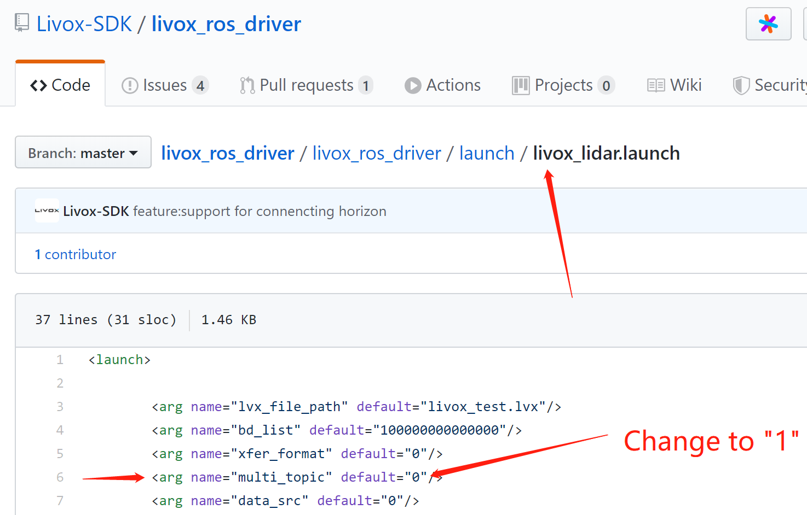
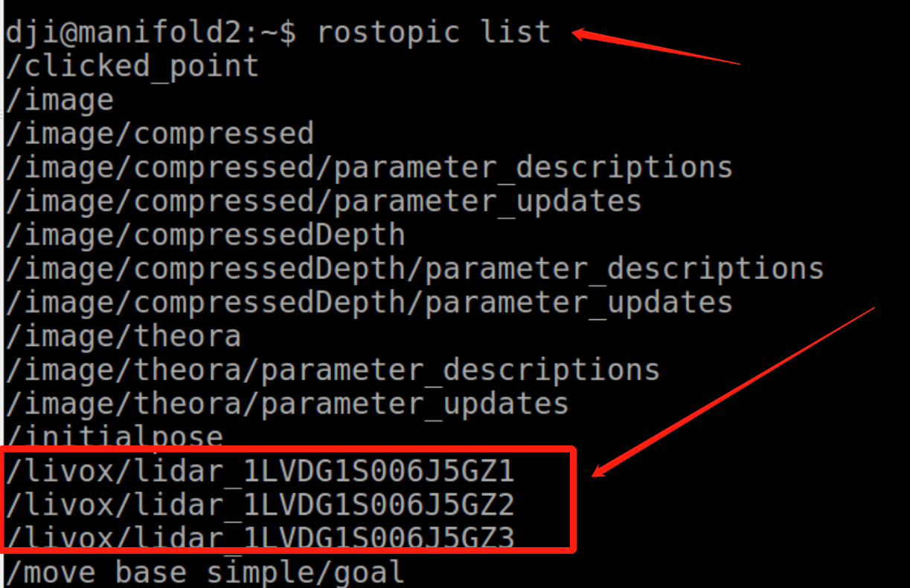
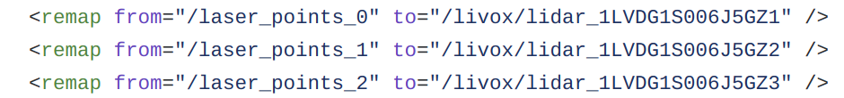

# Launch our package with Livox Mid-100
As we have mentioned in our [project page](./README.md), the default configuration of Livox-ros-driver mix all three lidar point cloud as together, which causes some difficulties in our feature extraction and motion blur compensation. By this, some of the adaptations (modify some configurations) are required to launch our package :)
<div align="center">
    
</div>
# 1. Installation the newest [Livox-SDK](https://github.com/Livox-SDK/Livox-SDK) and [Livox-ros-driver](https://github.com/Livox-SDK/livox_ros_driver)
Publish the Mid-100 point cloud data as three independence topics is the relatively new feature of drivers. If you are using the older kits, please update your driver (including both the SDK and ROS-dirver) as the newest version.  

## 1.1 Install Livox-SDK
Follow [Livox-SDK Installation](https://github.com/Livox-SDK/Livox-SDK).
## 1.2 Install Livox-ros-driver 

Follow [Livox-ros-driver Installation](https://github.com/Livox-SDK/livox_ros_driver).

## 2. Publish Mid-100 point cloud data as three independence topics
To change the way of publishing the point cloud, you can modify the parameter named "multi_topic" in the launch file ([livox_lidar.launch](https://github.com/Livox-SDK/livox_ros_driver/blob/master/livox_ros_driver/launch/livox_lidar.launch) ) from "0" to "1", like this:
<div align="center">
    
</div>


If your configurations are correct, you will see this the point cloud data are published by three rostopics, like this:
```
roslaunch livox_ros_driver livox_lidar.launch
rostopic list 
```
<div align="center">
    
</div>
The ros-messages with its topic named **"/livox/lidar_SN"** is of the data published by Mid-100.

## 3. Launch our package
Before launch our package, you need to remap the topic to ensure our package can receive the point cloud data.

Open our launch files (for example, the [rosbag_mid100.launch](./launch/rosbag_mid100.launch)), then remap the topic name "/laser_points_0", "/laser_points_1" and "/laser_points_3" to the topic "/livox/lidar_SN", shown as the following figure:
<div align="center">
    
</div>

## 4. Rosbag example
Download our recorded rosbag files ([mid100_example.bag](mid100_example) ), then:
```
roslaunch loam_livox rosbag_mid100.launch
rosbag play mid100_example.bag
```